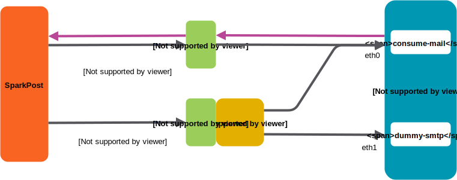

# Bouncy Sink configuration

The Bouncy Sink is based on PMTA, with specific "blackhole" configuration used bounce some traffic with realistic in-band bounce
codes. The other sink actions are handled by a script that is scheduled by `cron` to run once a minute.

## Pre-requisites

Host capable of running PMTA 4.x
- Host has TCP port 25 open to inbound traffic
- python3 + pip
- git cli
- PMTA install file + 4.x license
- redis
- gunicorn (for web reporting)

## Example installation - with Amazon EC2 Linux

See [INSTALLING.md](INSTALLING.md)

## Network environment

The PMTA blackhole service configured in the `dummy-smtp-` settings requires its own host IP address (it can't be set in a virtual MTA).

The other bouncy sink features live on the regular PMTA listener address, which simply relays to a directory.

These distinct services can coexist on one PMTA instance on one host, with two NICs and IP addresses.

To enable single mail stream to experience the full range of sink responses, the main inbound domain is mapped to an AWS ELB.
ELB sharing percentage is non-configurable, so the .ini file is set to account for 50% / 50% between the listeners. 
Specific domains map to the regular PMTA listener, allowing direct access to those sink features.



The usual PMTA listener serves eth0, and the special `dummy-smtp` listener serves eth1.

The direct action subdomains `fbl`, `oob`, `openclick`, and `accept` map to Elastic IP 1, which also handles all host outbound connections:
- FBL & OOB delivery
- http(s) opens & clicks.

## .ini file

The .ini file allows you to adjust the statistical model percentages (which are floating-point values).
The `Upstream_Handled` variable is used to allow for the amount that's already handled outside this process (e.g. PMTA blackhole).

## Behaviour under load

Python's  timed rotating logfile handler was found to be not process-safe (files get truncated at midnight if more than one process
is running). So the app now runs one instance, started manually or once by crontab. The app creates multiple threads.

## Logfiles

As well as the usual PMTA logfiles, the script generates its own daily logfile with midnight rotation, courtesy of Python's
wonderful logging library.

Logfile location and base name is specified in the .ini file. After a day or so you should see

```
-rw-r--r-- 1 root     root     675150902 May 15 21:50 consume-mail.log
-rw-rw-r-- 1 ec2-user ec2-user  43478207 May 14 23:59 consume-mail.log.2018-05-14
```

The .ini file also sets how many days history to retain.

Logfile shows
- date/time
- logging name 'consume-mail'
- Level (=INFO mostly)
- inbound filename
- inbound mail `To:` address
- inbound mail `From:` address
- actions taken e.g. `Open, Click, OpenAgain, ClickAgain, OOB sent, FBL sent`

Application-level errors are marked in the actions area, with prefix **`!`** for example
`!FBL not sent, Return-Path not recognized as SparkPost`

These indicate there was something unacceptable about the input mail that we found, or that there was a problem sending an SMTP FBL
or OOB reply back to SparkPost.

## consume-mail.py script parameters

If running the usual setup from crontab, you can skip this section.

The script is fed a directory (where it looks for, processes, and deletes) files ending in `.msg`.

```
$ src/consume-mail.py -h
usage: consume-mail.py [-h] [-f] directory

Consume inbound mails, generating opens, clicks, OOBs and FBLs. Config file
consume-mail.ini must be present in current directory.

positional arguments:
  directory   directory to ingest .msg files, process and delete them

optional arguments:
  -h, --help  show this help message and exit
  -f          Keep looking for new files forever (like tail -f does)
```

## Script internals

The `fblGen` and `oobGen` functions are closely based on Dave Gray's excellent command-line tools in `Go`, as per comments.

Open and click handling uses a persistent TCP "requests" session, which provides better performance and consumes fewer
host socket resources.  The `HTMLParser` class is used for reading the mail body.

As noted in [README.md], all inbound mail must have a valid DKIM signature. The function `processMail` additionally checks

- for direct FBL and OOB streams, that SPF passes. We can't apply that check to the statistical "mixed" stream, because the AWS
ELB replaces the connecting IP address with its own, causing the check to always fail.
- FBL and OOB mail replies will only be sent to Return-Path MXs recognised as SparkPost. If you wish to relax this, change the function `mapRP_MXtoSparkPostFbl`.
- FBL and OOB mail replies are sent directly back using SMTP (not using PMTA's queuing). That allows the SMTP response code errors to be logged, at the expense of the thread blocking. In practice this is not a
problem with low percentages of FBL and OOBs
- `getBounceProbabilities` and `checkSetCondProb` set up the conditional probabilites for the `processMail` decision tree.
- `consumeFiles` chews file(s) over a single run, handling file reading and logging duties. Each file is processed by launching
`processMail` in separate threads to maximise throughput.
- Because threads cannot directly return values back, each thread writes result strings to a `queue`. The master thread gets these and 
emits lines to the logfile.


Performance on a Medium instance was essentially linear with up to 12 threads, and therefore can handle hundreds of inbound messages per second.

## Possible further work

A specific domain to "in-band bounce 100% of traffic" is *not* provided, because (given current PMTA functionality) it would require a separate host & PMTA
instance.