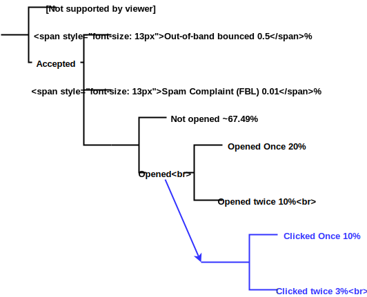
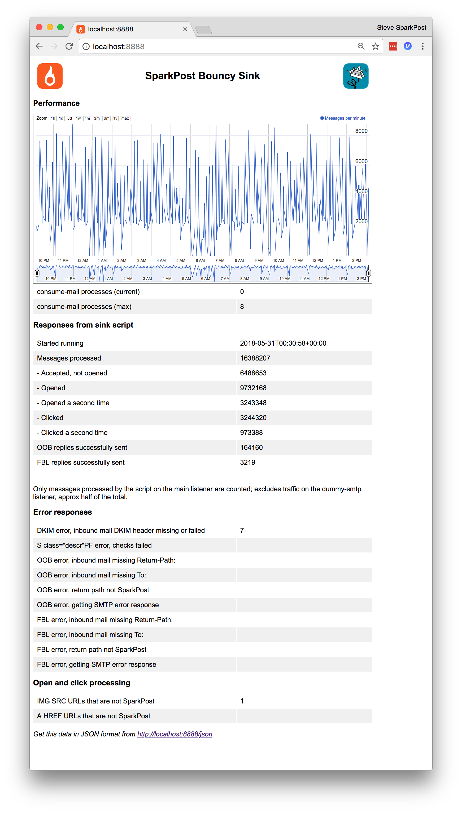

<a href="https://www.sparkpost.com"></a>

[Sign up](https://app.sparkpost.com/join?plan=free-0817?src=Social%20Media&sfdcid=70160000000pqBb&pc=GitHubSignUp&utm_source=github&utm_medium=social-media&utm_campaign=github&utm_content=sign-up) for a SparkPost account and visit our [Developer Hub](https://developers.sparkpost.com) for even more content.

# Bouncy Sink for SparkPost traffic

[](https://travis-ci.org/SparkPost/bouncy-sink)

The Bouncy Sink is a place where you can send your test email to. It simulates some aspects of real-world
email user and ISP behaviour, such as in-band and out-of-band [bounces](https://www.sparkpost.com/blog/wild-west-bounce-codes-deliverability/),
[FBLs](https://www.sparkpost.com/blog/why-feedback-loops-matter/), [opens and clicks](https://www.sparkpost.com/blog/email-user-engagement-metrics/).

Please note that traffic to the sink **still counts as usage on your account.**

**Why use this?** Sending test traffic to real ISP domains (such as gmail.com, hotmail and so on) that isn't actually
for humans to open, such as to "made up" addresses that bounce, can quickly damage your [email reputation](https://www.sparkpost.com/blog/email-reputation-matters/). 

## Generating traffic toward the sink

To use the sink, simply send SparkPost traffic to it.
Any valid method can be used to generate traffic from SparkPost toward the sink.

Here is [a traffic generator](https://github.com/tuck1s/sparkpost-traffic-gen)
which can easily be deployed to Heroku, to generate random traffic through your SparkPost account toward the "bouncy sink" domains.

## Recipient Domains

Different response behaviours are available, through choice of recipient subdomain.  The localpart of the address can be anything.

|Response Behaviour|Use Recipient Address|
|-------------|--------------------------|
|Accept quietly, without opens or clicks|`any@accept.bouncy-sink.trymsys.net`|
|Out-of-band bounce|`any@oob.bouncy-sink.trymsys.net`|
|Spam Complaint (ARF format FBL) |`any@fbl.bouncy-sink.trymsys.net`|
|Accepted and opened at least once|`any@openclick.bouncy-sink.trymsys.net`|
|Statistical mix of responses|`any@bouncy-sink.trymsys.net`|

The subdomain part immediately after the `@` is checked, so `@fbl.bouncy-sink.trymsys.net` and `@fbl.fred.wilma.bouncy-sink.trymsys.net`
trigger the same behaviour.

Other subdomains, for example `foo.bar.bouncy-sink.trymsys.net` will give the statistical
mix of responses.

Open and click tracking requires a valid html part in your mail content, and the relevant tracking options
to be enabled in your SparkPost account & transmission. "Click" tries to follow all links present in the html part.

### Statistical model

This is the default setup:



This can be customised using the .ini file if you are deploying your own bouncy sink instance - see [here](CONFIGURING.md).

Clicks are done only if the mail was also opened, so the event sequence can be:

```
[ Open [Open] [Click [Click] ] ]
```

## In-band bounces

This sink uses PMTA's built-in facility to generate in-band bounces with both 4xx (tempfail) and 5xx (permfail) codes on a portion of traffic.
The codes are varied at random, and are typical of what a real ISP might send back.
The 4xx codes will show up on SparkPost reporting as "delayed" mails, and they will be retried.

## Actions on the mail content

For these actions, messages must have a valid DKIM signature.

### Opens and Clicks

If an HTML mail part is present, the sink opens ("renders") the mail by fetching `` tags 
present in the received mail that are served by SparkPost's engagement tracker endpoint.

The sink clicks links in similar manner by fetching any  `<a .. href="..">` tags present in the received mail.

The sink uses an `OPTIONS` http request (which will, conicidentally be rejected by the engagement tracker) to check the server type.
It does not actually follow the link redirect, or fetch the whole object.

The User-Agent is randomly selected from a realistic set of current, popular browsers.

### FBLs (aka Spam Complaints)

The sink responds to a some mails with an FBL back to SparkPost in ARF format.  The reply is constructed as follows:

- Additional checks below must pass
- The FBL `From:` header address and `MAIL FROM` is the received mail `To:` header value, which must be present
- The FBL `To:` header address and `RCPT TO` is derived by looking up the received mail `Return-Path:` MX, according to the below table
- The `X-MSFBL` header is populated from the received mail
- The ARF-format FBL mail is attempted directly over SMTP to the relevant MX (simply choosing the first MX, if there is more than one)
- SMTP error responses are logged

|Service |MX |fblTo |
|--------|---|------|
|SparkPost|smtp.sparkpostmail.com|`fbl@sparkpostmail.com`
|SparkPost Enterprise|*tenant*.mail.e.sparkpost.com|`fbl@tenant.mail.e.sparkpost.com`
|SparkPost EU|smtp.eu.sparkpostmail.com|`fbl@eu.sparkpostmail.com`

The FBLs show up as `spam_complaint` events in SparkPost.

### Out-of-band bounces

OOB bounce replies are constructed as follows:

- Additional checks below must pass
- The OOB `From:` header address and `MAIL FROM` is taken from the received mail `To:` header value
- The OOB `To:` header address and `RCPT TO` is taken from the received mail `Return-Path:` header
- The OOB mail is attempted directly over SMTP to the relevant MX (choosing the first MX if there is more than one)
- Endpoint error responses are logged

The OOBs show up as `out_of_band` events in SparkPost.

### Additional checks on OOB and FBL actions

To reduce the effect of bad actors trying to use the sink to mount a [backscatter spam](https://en.wikipedia.org/wiki/Backscatter_(email)) attack, 
the direct OOB and FBL actions also require SPF to pass (so we know the originating IP is valid for the domain).

All OOB and FBL actions require the `Return-Path:` MX to resolve back to a known SparkPost endpoint.

### Internal application logfile

All actions are logged, with configurable logfile retention and midnight rotation.

### Redis & Web reporting

The main script increments counters in `redis` which can be queried directly using `redis-cli`:

```
$ redis-cli
127.0.0.1:6379> keys *
 1) "consume-mail:0:int_fbl_sent"
 2) "consume-mail:0:startedRunning"
 3) "consume-mail:0:int_open_again"
 4) "consume-mail:0:int_open"
 5) "consume-mail:0:int_fail_dkim"
 6) "consume-mail:0:int_oob_sent"
 7) "consume-mail:0:int_accept"
 8) "consume-mail:0:int_click_again"
 9) "consume-mail:0:int_total_messages"
10) "consume-mail:0:int_click"
11) "consume-mail:0:int_open_url_not_sparkpost"
127.0.0.1:6379> get consume-mail:0:int_total_messages
"13315977"
```
`webReporter.py` is a simple Flask-based reporting app to present these counters.
`gunicorn` is started on private port number 8888 on reboot by `crontab` which calls script `starting-gun.sh`.

On your client, open an SSH connection with port 8888 tunneled:
```
ssh -i ##YourPrivateKeyHere## -L 8888:localhost:8888 YourUser@example.com
```

Open page `localhost:8888` on your client browser:



You can also fetch the stats in JSON format:
```
$ curl -s localhost:8888/json | jq .
{
  "fbl_sent": 2607,
  "fail_dkim": 7,
  "oob_sent": 133559,
  "startedRunning": "2018-05-31T00:30:58+00:00",
  "open_again": 2640376,
  "click": 2642225,
  "total_messages": 13340946,
  "open": 7922352,
  "open_url_not_sparkpost": 1,
  "accept": 5282421,
  "click_again": 792616
}
```

### SparkPost suppression list cleaning

Bounces will populate your suppression list. It's good practice to purge those entries relating to the sink domains when you've finished.
[Here is a tool](https://www.sparkpost.com/blog/suppression-list-python/) that you can use to clean up.

### Manually restarting the consume-mail task

Identify the current process number and kill the task:
```
ps aux | grep consume
sudo kill _processID_
```

Restart the task:
```
sudo src/consume-mail.py /var/spool/mail/inbound/ -f >/dev/null 2>&1 &
```

### User Agent values (on opens and clicks)

`consume-mail.ini` specifies a file that should contain the user-agent strings (in .CSV format), similar to those
from [here](https://developers.whatismybrowser.com/useragents/explore/software_type_specific/web-browser/).

```
Software,OS,Layout engine,Popularity,
"Mozilla/5.0 (Windows NT 10.0; Win64; x64) AppleWebKit/537.36 (KHTML, like Gecko) Chrome/60.0.3112.113 Safari/537.36",Chrome 60,Windows,Blink,Very common
:
etc
```
Only the "Software" column of this file is used. A user-agent is picked at random for each mail, prior to open and click processing.

## See Also

[Internal configuration details](CONFIGURING.md)

[Simple "accept" sink built in to SparkPost](https://www.sparkpost.com/docs/faq/using-sink-server/)